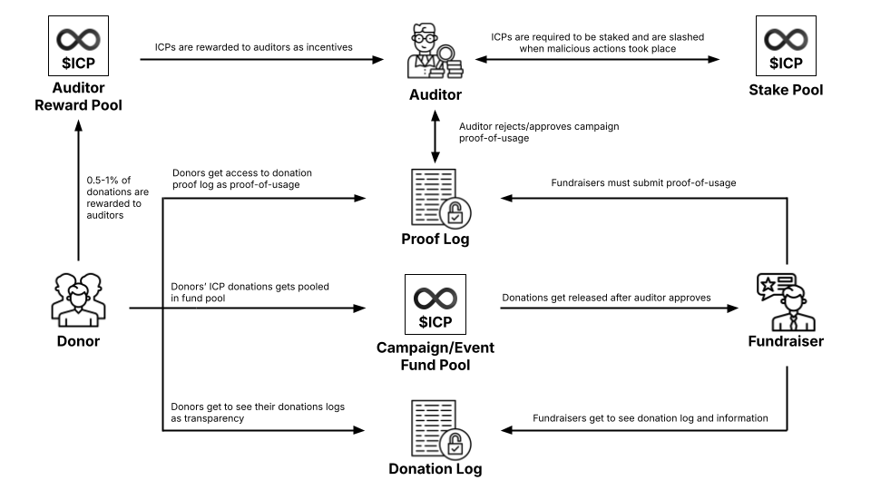

<div align="center"> 
  <h1> VeriFund </h1>
  <h3> Secure your kindness with Verifund! </h3>
  < Insert Front Page Image Here >
</div> <br>

<div align="center"> 


</div>

**VeriFund** is a decentralized, trustless platform built to revolutionize how people give. Powered by the Internet Computer, VeriFund allows anyone to create or contribute to donation campaigns with transparency, verifiability, and global accessibility.

Every donation is stored on-chain, publicly auditable, and protected by smart contract rules — ensuring that funds are not only received, but responsibly used. With a unique **proof-of-donation** and **proof-of-usage** model, VeriFund builds a culture of accountability without compromise.

## 📚 Table of Contents
- [Why?](#why)
- [Solution & Opportunity: VeriFund](#solution--opportunity-verifund)
- [VeriFund's Vision and Mission](#verifunds-vision-and-mission)
- [Tech Stack](#tech-stack)
- [Core Features](#core-features)
- [Roles in System](#roles-in-system)
- [How to Build](#how-to-build)
- [Future Development Plans](#future-development-plans)
- [License](#license)


## ❓ Why?

Charity and donation systems across the world face a persistent and growing crisis: a lack of transparency, traceability, and trust. According to the **Charities Aid Foundation (CAF World Giving Index 2023)**:

* Global trust in NGOs and charitable institutions declined by over 10% in the past five years.
* $2.6 trillion in global donations yearly remain largely unverifiable in their usage.

Moreover:

* 80% of global donors say they would increase contributions if they could see exactly how donations are used.
* Scandals involving misuse of charity funds (e.g., Red Cross Haiti, Wounded Warrior Project) have damaged donor confidence worldwide.
* Most donations rely on centralized organizations acting as trusted intermediaries, which introduce high administrative costs and regional limitations.

At the same time, blockchain has matured to enable:

* Immutable on-chain data
* Transparent smart contract logic
* Decentralized identity (Internet Identity)
* Secure off-chain integrations (HTTPS outcalls)

VeriFund emerges to solve this pressing global need for trustless, proof-based, on-chain donation systems, enabling borderless giving with verifiable usage.

## 💡Solution & Opportunity: VeriFund 

VeriFund is not just a donation platform — it's an ecosystem of accountability, built on a blockchain that can actually support it i.e. the Internet Computer Protocol (ICP) that isn’t just another smart contract chain. It's the only blockchain that allows developers to build full-stack decentralized applications, including:

| ICP Capability         | Why It Matters for VeriFund                                                                                   |
|------------------------|---------------------------------------------------------------------------------------------------------------|
| On-chain compute   | VeriFund logic (timers, randomness, staking, auditing) runs fully on-chain, not just payment transactions.   |
| On-chain storage   | All campaign data, donations, and usage reports are stored and served directly from the chain — no centralized servers. |
| HTTPS Outcalls   | VeriFund can fetch and verify live data (e.g., price feeds, file links, external APIs) directly from the canister. |
| Certified Queries  | Donors see cryptographically certified frontend data, ensuring frontend integrity.                          |
| Internet Identity  | Users can login without passwords, securely and privately across devices.                                  |
| Autonomous Timers  | VeriFund can remind fundraisers daily, or trigger automated audits — all on-chain.                         |
| Near-zero gas fees | Enables microdonations, global access, and predictable costs.                                               |

This makes ICP the only chain where a system like VeriFund could emerge without depending on bridges, oracles, or Web2 services.

#### 🔗 VeriFund introduces a new donation paradigm where:

* **Every donation is public, verifiable, and tamper-proof**: Donors can check exactly when and how much was donated, down to the wallet.
* **Proof-of-usage is required and audited**: Fundraisers must submit links or files (in future: FileVault), and these are reviewed by randomly selected public auditors.
* **Auditors stake ICP to participate**: They have skin in the game: honest actors are rewarded; inactive ones are penalized.
* **All data is on-chain and certifiable**: Even the frontend views shown to users are backed by certified data, making fake interfaces impossible.
* **Global, borderless donations are enabled**: Donors use ICP, a crypto-native, low-fee token — no banks, no PayPal, no restrictions.
* **VeriFund is fully decentralized**: No central authority controls funds. All logic is transparent, auditable, and upgradeable.

#### 🌍 Opportunity 

* Small grassroots campaigns in underserved regions can raise funds internationally.
* Disaster relief efforts can be tracked and verified by the public.
* NGOs and aid groups can prove transparency without costly reporting overhead.
* Auditors become incentivized third parties, not internal staff.

## 🎯VeriFund's Vision and Mission

#### Vision

To create a global standard for transparent, trustless, and verifiable charitable giving using decentralized technologies.

#### Mission

1. Make donations verifiable
2. Break down global donation barriers
3. Establish trust through blockchain technology
4. Reward responsible fundraisers and auditors


## 🛠️Tech Stack

| Layer        | Technology                                                                       |
|--------------|----------------------------------------------------------------------------------|
| Backend      | **Motoko** (actor-based language for ICP canisters)                           |
| Identity     | **Internet Identity** (passwordless decentralized auth)                       |
| Storage      | **Certified Data**, on-chain HashMap, stable memory, file vault                         |
| Communication| **HTTPS Outcalls** to fetch live price/proofs                                |
| Logic        | **Timers**, randomness (for auditor selection)                                |
| Frontend     | **React + Vite** deployed as an ICP asset canister                            |
| Platform     | **Internet Computer Protocol (ICP)**                                          |


## ✨Core Features

| Feature                          | Description                                                                                      |
|----------------------------------|--------------------------------------------------------------------------------------------------|
| Transparent Donation Logs | All donation history is stored on-chain and publicly accessible.                            |
| Certified Frontend Access | Ensures users are reading verified, non-fake data using **certified variables                |
| Proof-of-Usage Upload     | Fundraisers upload external links or files as proof of how funds were used.                    |
| Public Auditors             | Each campaign randomly selects an auditor to review and approve usage reports.                 |
| Staking + Reward Mechanism| Auditors stake ICP to be eligible. Honest auditors get rewards, lazy ones get penalized.       |
| Reminder System (Timers)  | Daily on-chain reminders encourage fundraisers to submit proof.                                |
| Live ICP/USD Conversion   | Uses HTTPS outcalls to Coinbase API for accurate pricing.                                  |
| Global, Borderless Platform | Open to everyone worldwide — no banks, no borders, just trustless giving.               |              

#### Donation & Proof Flow



## 🧑‍🤝‍🧑Roles in System

#### 👤 1. Donor
* Can donate ICP to any campaign.
* Donations are stored transparently and shown publicly.
* Can check reports & auditor logs.

#### 🧑‍💼 2. Fundraiser
* Can create campaigns with target and description.
* Must submit proof of fund usage (e.g., links, invoices).
* Will be reminded via timers if no report is submitted.

#### 🕵️ 3. Auditor
* Must stake ICP to be eligible.
* Randomly selected monthly per campaign.
* Must approve/reject proofs submitted by fundraisers.
* Rewarded if diligent. Slashed if negligent.


## 🏗️ How to Build

### Required Tech Stack (install first if not available)
- DFX CLI (https://internetcomputer.org/docs/current/developer-docs/setup/install/)
- Node.js & NPM (https://nodejs.org)
- Motoko Package Manager (Mops)

### 1. Install developer tools.

You can install the developer tools natively or use Dev Containers.

#### Option 1: Natively install developer tools

> Installing `dfx` natively is currently only supported on macOS and Linux systems. On Windows, it is recommended to use the Dev Containers option.

1. Install `dfx` with the following command:

```

sh -ci "$(curl -fsSL https://internetcomputer.org/install.sh)"

```

> On Apple Silicon (e.g., Apple M1 chip), make sure you have Rosetta installed (`softwareupdate --install-rosetta`).

2. [Install NodeJS](https://nodejs.org/en/download/package-manager).

3. For Motoko projects, you will also need to:

- Install the Motoko package manager [Mops](https://docs.mops.one/quick-start#2-install-mops-cli): 
```bash
npm i -g ic-mops
```

#### Option 2: Dev Containers

Continue building your projects locally by installing the [Dev Container extension](https://marketplace.visualstudio.com/items?itemName=ms-vscode-remote.remote-containers) for VS Code and [Docker](https://docs.docker.com/engine/install/).

Make sure Docker is running, then navigate into your project's directory that you downloaded from ICP Ninja and start the Dev Container by selecting `Dev-Containers: Reopen in Container` in VS Code's command palette (F1 or Ctrl/Cmd+Shift+P).

> Note that local development ports (e.g. the ports used by `dfx` or `vite`) are forwarded from the Dev Container to your local machine. In the VS code terminal, use Ctrl/Cmd+Click on the displayed local URLs to open them in your browser. To view the current port mappings, click the "Ports" tab in the VS Code terminal window.

### 2. Clone or enter your project
 ```bash
git clone https://github.com/Incheon21/verifund.git
cd verifund
 ```

### 3. Start local DFX network
 ``` bash
dfx start --background
 ```

### 4. (Recommended) Create and switch to your dev identity
  ```
dfx identity new dev
dfx identity use dev
 ```

### 5. Install frontend dependencies
 ```
npm install
 ```

### 6. Deploy canisters locally
 ```
dfx deploy
 ```

## 🔮 Future Development Plans

| Planned Feature                             
|-------------------------------------------|
| Token/NFT badge for donors & contributors |
| Multi-language frontend                   |
| On-chain reputation score                 | 
| Campaign sharing / social embed tools     | 
| Decentralized comment + voting thread     | 
| Private donation option                   | 
| Campaign audit history & reviewer logs    | 


## 📄 License 

MIT License

Copyright (c) 2025 Cisli

Permission is hereby granted, free of charge, to any person obtaining a copy
of this software and associated documentation files (the "Software"), to deal
in the Software without restriction, including without limitation the rights
to use, copy, modify, merge, publish, distribute, sublicense, and/or sell
copies of the Software, and to permit persons to whom the Software is
furnished to do so, subject to the following conditions:

The above copyright notice and this permission notice shall be included in all
copies or substantial portions of the Software.

THE SOFTWARE IS PROVIDED "AS IS", WITHOUT WARRANTY OF ANY KIND, EXPRESS OR
IMPLIED, INCLUDING BUT NOT LIMITED TO THE WARRANTIES OF MERCHANTABILITY,
FITNESS FOR A PARTICULAR PURPOSE AND NONINFRINGEMENT. IN NO EVENT SHALL THE
AUTHORS OR COPYRIGHT HOLDERS BE LIABLE FOR ANY CLAIM, DAMAGES OR OTHER
LIABILITY, WHETHER IN AN ACTION OF CONTRACT, TORT OR OTHERWISE, ARISING FROM,
OUT OF OR IN CONNECTION WITH THE SOFTWARE OR THE USE OR OTHER DEALINGS IN THE
SOFTWARE.